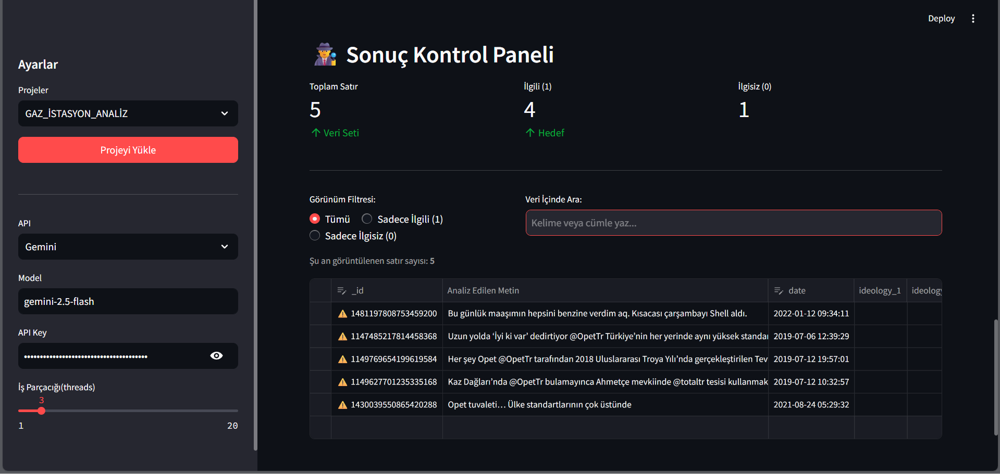
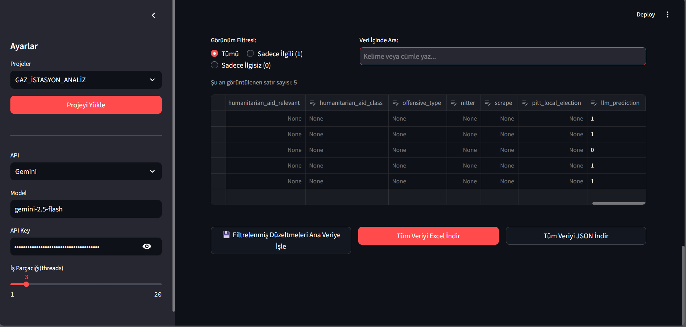

# 🏷️ AI Labeling Studio

AI Labeling Studio, kodlama bilmeyen kullanıcıların bile Large Language Model (LLM) kullanarak
metin verilerini **relevant / irrelevant (1 / 0)** şeklinde etiketleyebilmesi için geliştirilmiş,
web tabanlı (Streamlit) bir annotation aracıdır.

Uygulama; kullanıcıdan prompt alır, veriyi otomatik etiketler,
sonuçları ekranda gösterir ve Excel / JSON olarak indirmenizi sağlar.

Repo: https://github.com/Emrecangok/AI-Labeling-Studio

---

## 🚀 Neler Yapabilir?

- OpenAI ve Google Gemini desteği
- Prompt’u parçalara bölerek yazma (Role / Include / Exclude / Output)
- Çoklu veri üzerinde hızlı (paralel) annotation
- Sonuçları ekranda görme ve manuel düzeltme
- Excel ve JSON çıktı alma
- Proje bazlı prompt kaydetme ve tekrar kullanma

---

## 📥 Kurulum 

### Repoyu indir
GitHub sayfasında **Code → Download ZIP** diyerek indir  
ve klasörü aç.

---

### Gerekli paketleri kur

Klasörün içine gir: cd C:\Users\emrec\NER\dspy_ai(ÖRNEKTİR)

pip install -r requirements.txt

###  Uygulamayı Çalıştır
streamlit run main_.py

### Tarayıcı otomatik açılmazsa:

http://localhost:8501

### 🧠 Kullanım Akışı (UI Üzerinden)

# 1.APİ AYARLARINI YAP

Sol menüde yer alan teknik ayarlar şunlardır:

**1. 📂 Proje Seçimi**
* **Ne İşe Yarar:** Daha önce kaydedilmiş `.json` formatındaki ayar dosyalarını listeler ve tek tıkla yükleyerek kaldığınız yerden devam etmenizi sağlar.(Daha önce oluşturulmadıysa yeni projede kalmalı.)

**2. 🤖 API Sağlayıcı (Provider)**
* **Ne İşe Yarar:** İşlemin hangi altyapı üzerinde çalışacağını belirler (OpenAI veya Google Gemini).

**3. 🧠 Model**
* **Ne İşe Yarar:** Seçilen sağlayıcının hangi versiyonunun kullanılacağını belirler (Örn: `gpt-4o-mini`, `gemini-1.5-flash`).

**4. ⚡ Hız (Thread Sayısı)**
* **Ne İşe Yarar:** Eşzamanlı (concurrent) olarak kaç adet API isteği gönderileceğini belirler.

# 2.Veri Seti Yükle

CSV / XLSX / JSON / JSONL

Analiz Edilecek Metin Kolonunu Seç
(LLM'e gönderilecek olan metindir)

## 📝 Prompt Tasarım Alanları ve İşlevleri

Uygulama arayüzündeki parametrelerin işlevleri ve arka planda AI modeline gönderilip gönderilmediği aşağıda detaylandırılmıştır:

**1. 🏷️ Marka Adı**
* **Ne İşe Yarar:** Projenin hangi marka veya kategori için çalışıldığını belirten referans (metadata) alanıdır.
* **Prompt'a Etkisi:** ❌ **HAYIR.** (Bu veri AI modeline gönderilmez, sadece kullanıcı takibi içindir.)

**2. 💾 Proje Kayıt Adı**
* **Ne İşe Yarar:** Mevcut konfigürasyonun kaydedileceği `.json` dosyasının dosya adını belirler.
* **Prompt'a Etkisi:** ❌ **HAYIR.** (AI modeline gönderilmez.)

**3. 1️⃣ Rol ve Giriş (Role)**
* **Ne İşe Yarar:** AI modeline sistem rolünü ve uzmanlık alanını atar. (Örn: "Sen kıdemli bir veri analistisin.")
* **Prompt'a Etkisi:** ✅ **EVET.** (Promptun en üst kısmına sistem mesajı olarak eklenir.)

**4. 2️⃣ İlgili Durumlar (Include)**
* **Ne İşe Yarar:** Verinin pozitif (1) olarak sınıflandırılması için gerekli kriterlerin maddeler halinde tanımlandığı alandır.
* **Prompt'a Etkisi:** ✅ **EVET.** (Prompt içerisinde "Relevant if..." başlığı altına eklenir.)

**5. 3️⃣ Hariç Durumlar (Exclude)**
* **Ne İşe Yarar:** Verinin negatif (0) olarak sınıflandırılması veya kapsam dışı bırakılması gereken durumların tanımlandığı alandır.
* **Prompt'a Etkisi:** ✅ **EVET.** (Prompt içerisinde "Exclude as..." başlığı altına eklenir.)

**6. 4️⃣ Çıktı Formatı (Format)**
* **Ne İşe Yarar:** Modelin gereksiz açıklama yapmasını engelleyerek, sadece istenen formatta (Örn: Sadece 0 veya 1) çıktı üretmesini sağlayan kesin talimattır.
* **Prompt'a Etkisi:** ✅ **EVET.** (Promptun en sonuna, analiz edilecek metinden hemen önce eklenir.)

test limitinden kaç veriyi işleyeceğini seç ve başlat düğmesine tıkla!

# 3 🕵️‍♂️ Sonuç Kontrol Paneli

AI analizi tamamlandıktan sonra devreye giren bu panel, verinin doğruluğunu denetlemek ve hataları manuel olarak düzeltmek için tasarlanmıştır.

**1. 📊 Canlı İstatistikler**
* **Ne İşe Yarar:** Veri setinin genel dağılımını (Toplam satır, İlgili/İlgisiz sayısı) anlık olarak gösterir.
* **Özellik:** Editör üzerinde yapılan her manuel değişiklikte (örn: 0'ı 1 yapmak) bu rakamlar otomatik olarak güncellenir.

**2. 🔍 Filtreleme ve Arama**
* **Ne İşe Yarar:** Hatalı etiketleri daha hızlı bulmak için görünümü daraltmanızı sağlar.
* **Fonksiyonlar:**
    * **Radyo Butonları:** Veriyi "Sadece İlgili (1)" veya "Sadece İlgisiz (0)" olarak filtreler.
    * **Arama Çubuğu:** Metin (Text) kolonu içerisinde kelime bazlı arama yapar.

**3. 📝  Veri Editörü**
* **Ne İşe Yarar:** AI'ın hatalı etiketlediği satırları manuel olarak düzeltmenizi veya gereksiz satırları silmenizi sağlar.

**4. 💾  Senkronizasyon (Sync Button)**
* **Ne İşe Yarar:** Filtrelenmiş veya aranmış bir görünümde (örneğin sadece 10 satır görünürken) yaptığınız değişiklikleri, arka plandaki ana veri setindeki (örneğin 1000 satır) doğru satırlarla eşleştirip kaydeder.

**5. 📥 Dışa Aktarım (Export)**
* **Ne İşe Yarar:** Düzenlenmiş ve son hali verilmiş veri setini bilgisayarınıza indirir.
* **Formatlar:** Excel (`.xlsx`) ve JSON.

Fotoğrafta görüldüpü gibi llm_prediction sutununda dil modelinin tahminleri verilmiştir.

