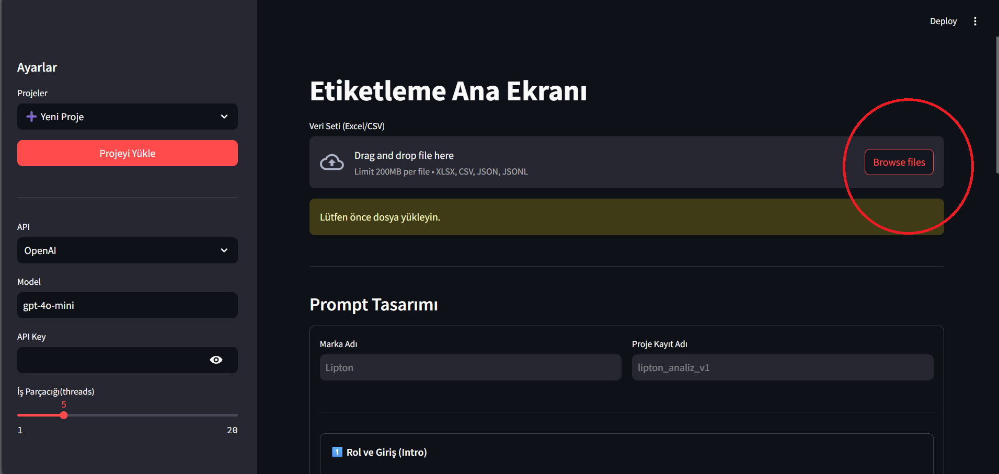
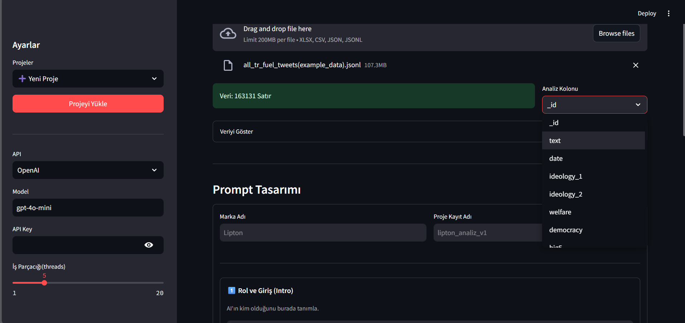
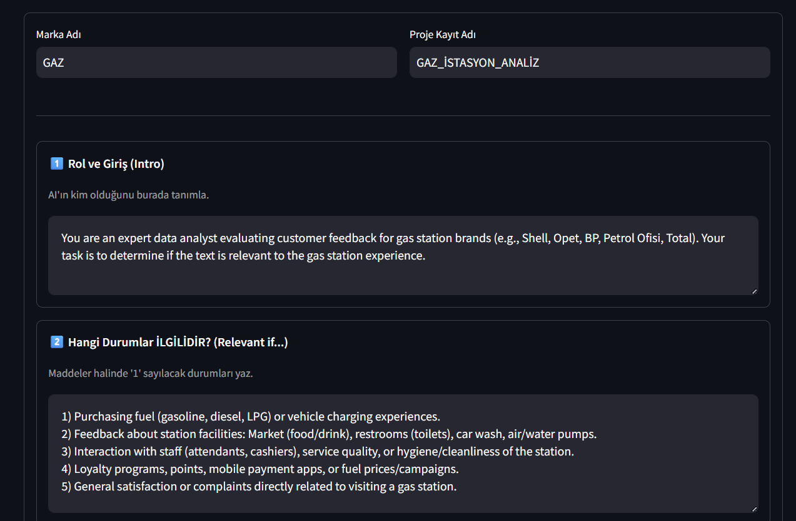
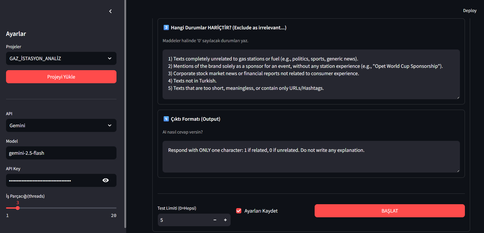

# 🏷️ AI Labeling Studio

**AI Labeling Studio**, kodlama bilgisine ihtiyaç duymadan Büyük Dil Modellerini (LLM) kullanarak metin verilerini **Relevant (1)** veya **Irrelevant (0)** şeklinde etiketlemenizi sağlayan, Streamlit tabanlı açık kaynaklı bir annotation aracıdır.

Bu araç ile binlerce satırlık veriyi dakikalar içinde analiz edebilir, sonuçları arayüz üzerinde filtreleyip düzeltebilir (**Human-in-the-loop**) ve Excel / JSON formatında dışarı aktarabilirsiniz.

🔗 **Repo:** https://github.com/Emrecangok/AI-Labeling-Studio

---

## 🚀 Özellikler

- **Çoklu Model Desteği:** OpenAI (GPT-4o, GPT-3.5) ve Google Gemini (Flash, Pro)
- **Paralel İşleme:** `Concurrent Futures` ile çoklu thread kullanımı
- **Detaylı Prompt Yönetimi:** Role / Include / Exclude / Output ayrımı
- **Akıllı Arayüz:** Anlık filtreleme, arama ve manuel düzeltme
- **Proje Yönetimi:** Prompt ayarlarını proje bazlı kaydetme
- **Esnek Çıktı:** Excel (`.xlsx`) ve JSON dışa aktarma

---

## 📥 Kurulum

Projeyi kendi bilgisayarınızda çalıştırmak için aşağıdaki adımları izleyin.

### 1. Repoyu İndirin

git clone https://github.com/Emrecangok/AI-Labeling-Studio.git  
cd AI-Labeling-Studio

### 2. Gerekli Paketleri Kurun

pip install -r requirements.txt

### 3. Uygulamayı Çalıştırın

streamlit run main.py

Tarayıcı otomatik açılmazsa:

http://localhost:8501

---

## 🧠 Kullanım Kılavuzu

Uygulama arayüzü 3 ana aşamadan oluşur:

- Ayarlar  
- Veri İşleme  
- Sonuç Kontrolü  

---

## ⚙️ Adım 1: API ve Sistem Ayarları (Sol Menü)

| Ayar | Açıklama |
|---|---|
| 📂 Proje Seçimi | Daha önce kaydedilmiş `.json` ayar dosyalarını yükler. Yeni başlıyorsanız **New Project** seçili kalabilir |
| 🤖 API Provider | OpenAI veya Google Gemini |
| 🧠 Model | Örn: `gpt-4o-mini`, `gemini-1.5-flash` |
| ⚡ Threads | Aynı anda işlenecek satır sayısı (Önerilen: 5–10) |

---

## 📝 Adım 2: Veri Yükleme ve Prompt Tasarımı

Bu aşamada verinizi yükler ve yapay zekaya ne yapması gerektiğini anlatırsınız.

### 1. Veri Setini Yükle

Desteklenen formatlar:

- CSV  
- XLSX  
- JSON  
- JSONL  

Dosyanızı sürükleyip bırakarak yükleyin.

---

### 2. Hedef Kolonu Seç (Analysis Column)

⚠️ **En Önemli Adım**

Yüklenen dosyadaki sütunlar sağ tarafta listelenir.  
Yapay zekanın okuyup analiz etmesini istediğiniz metin sütununu seçin  
(Örn: `Yorumlar`, `ReviewText`, `Tweet`).

---

### 3. Prompt Alanlarını Doldur

**Not:** Marka Adı ve Proje Kayıt Adı yalnızca sizin takibiniz içindir, modele gönderilmez.

#### Prompt Bileşenleri

1️⃣ **Rol (Role)**  
AI’a kimliğini tanımlayın.  
Örn: *“Sen kıdemli bir veri analistisin.”*

2️⃣ **İlgili Durumlar (Include)**  
Hangi durumlarda **1** verilmeli?  
Örn: *“Ürün kalitesinden şikayet ediliyorsa…”*

3️⃣ **Hariç Durumlar (Exclude)**  
Hangi durumlarda **0** verilmeli?  
Örn: *“Sadece kargo gecikmesiyse…”*

4️⃣ **Çıktı Formatı (Output)**  
Örn: *“Sadece 1 veya 0 yaz.”*

Tüm ayarlar tamamlandıktan sonra **Test Limit** (örn. 5 satır) belirleyip **START** butonuna basın.

---

## 🕵️‍♂️ Adım 3: Sonuç Kontrol Paneli (Results)

Analiz tamamlandığında detaylı bir kontrol paneli açılır.

- 📊 **Canlı İstatistikler:** Toplam veri ve 1 / 0 dağılımı
- 🔍 **Filtre & Arama:** Sadece `1` olanları filtreleme veya metin içinde arama
- 📝 **Veri Editörü:** `AI_Response` sütununu manuel olarak düzeltme
- 💾 **Save:** Filtreli görünümdeki değişiklikleri ana veri setine işleme
- 📥 **Dışa Aktar:** Sonuçları Excel veya JSON olarak indirme
  
